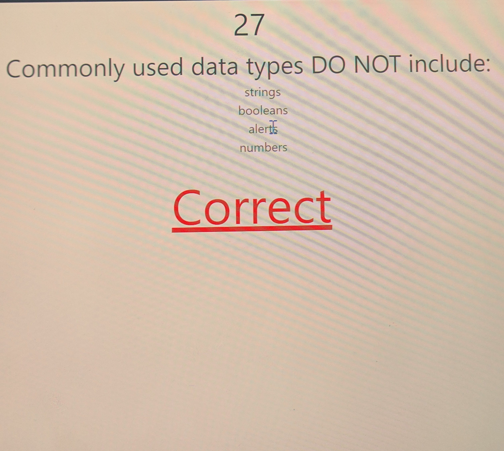
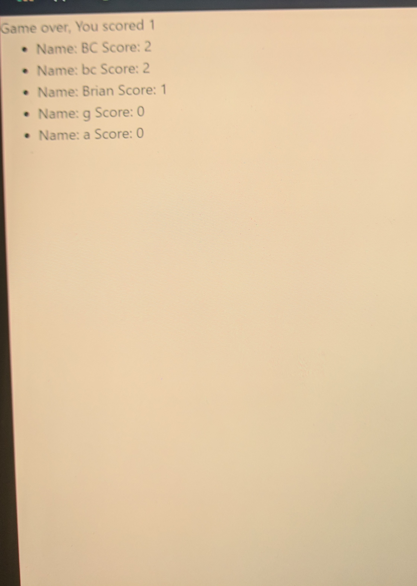
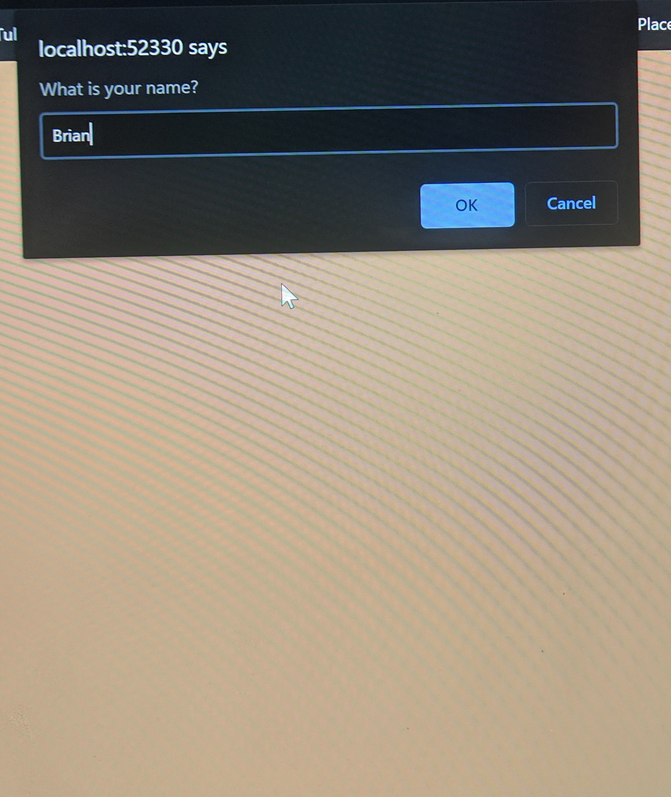

# PopQuizHW
Most of the work was completed in new file called script.js
1. Line 2 -50. First step to create questions for the quiz with a corresponding answer.
2. Lines 52-55. Create variables using document.queryselector to grab to id from the HTML file. 
3. Lines 57-58. Add variables to hold the time and intervaliD for the timer. And add variables for correct count and question index = 0.
4. Create endQuiz function - clear Interval and update DOM to indicate game is over.
5. Function show_highscore - ask user to input name. Name is then stored on local storage along with scores then list as an li after inputted on prompt. 
6. Timer function - decrement time every 1 second, when time === 0, end quiz. 
7. Function render question then function next quesiton.
8. Function check_answer - checks if answer is correct, Notify the user if their response is correct/wrong, Update the correctCount if necessary, wait 2 seconds and call next question.
9. Add event listener - when one of choice li is clicked, check_answer function is called 

